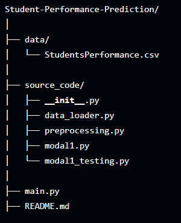
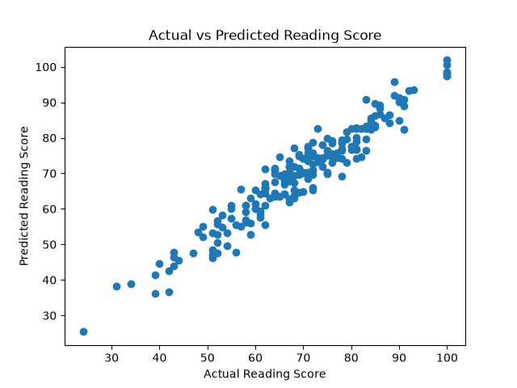
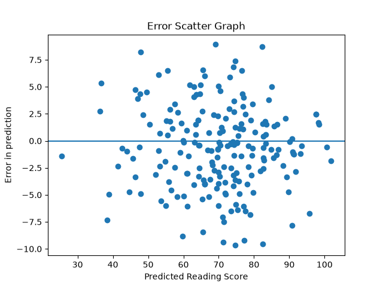
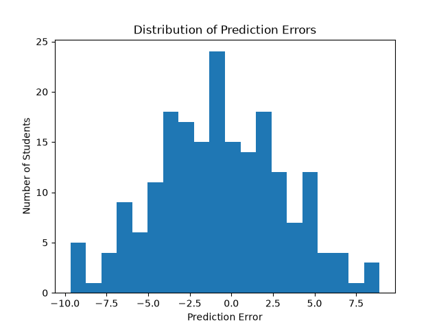
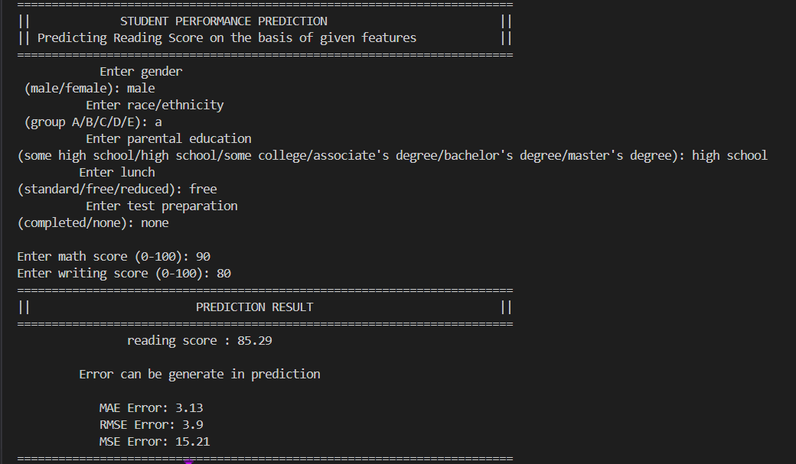

# Student Performance Prediction

A **Machine Learning project built from scratch using NumPy** to predict a student's **Reading Score** based on academic and demographic features.

The project demonstrates the complete ML workflow — from loading and preprocessing raw data to training a Linear Regression model, evaluating predictions, and making predictions for a new student.

## Project Objective

The goal of this project is to predict a student's **Reading Score** using: 

* Gender
* Race/Ethnicity
* Parental Education
* Lunch Type
* Test Preparation Course
* Math Score
* Writing Score

**Target:** Reading Score

## Machine Learning Approach

This project implements **Linear Regression from scratch** using NumPy.

Instead of directly using a machine-learning library for training, the model uses matrix operations and the **Normal Equation**:

**Y=W.X+b** for reading score prediction
 **w = (XᵀX)⁻¹Xᵀy** for weight calculation

The project also uses **Standardization**:
**X_scaled = (X - mean) / standard_deviation**

An intercept term is added to the feature matrix before prediction.

##  Project Workflow

Raw CSV Dataset  
       ↓ 
Data Loading 
       ↓
Data Cleaning & Encoding 
       ↓ 
One-Hot Encoding 
       ↓ 
Feature Matrix Creation 
       ↓ 
Train/Test Split 
       ↓ 
Feature Scaling 
       ↓ 
Linear Regression 
       ↓ 
Prediction 
       ↓ 
Model Evaluation 
       ↓ 
User Input Prediction 

## Project Structure

## Technologies Used

* **Python**
* **NumPy**
* **Matplotlib** — for visualization
* **Git & GitHub**
* Kaggle Student Performance dataset

## Features

### Data Preprocessing

Categorical variables are converted into numerical form using:

* Binary Encoding
* One-Hot Encoding

For example:

Race/Ethnicity 

Group A → [1,0,0,0,0]  
Group B → [0,1,0,0,0] 
Group C → [0,0,1,0,0] 
Group D → [0,0,0,1,0] 
Group E → [0,0,0,0,1] 

### Feature Scaling

Standardization is applied so that numerical features are on a comparable scale.

### Model

**Linear Regression using the Normal Equation**

### Evaluation

The model is evaluated using:

* MAE — Mean Absolute Error
* MSE — Mean Squared Error
* RMSE — Root Mean Squared Error

---

## Model Performance

On the test set, the model achieved approximately:

MAE  : 3.13  
MSE  : 15.21 
RMSE : 3.90 

This means the model's predictions are, on average, only a few points away from the actual reading scores on this test split.

> Results can vary depending on the train/test split and preprocessing implementation.

## Visualizations

### Actual vs Predicted

### Residual Plot

### Error Distribution

## Example

A user can enter information such as:

The system encodes the input, applies the same scaling used during training, and predicts the student's **Reading Score**.

## Future Improvements

* Add more regression algorithms
* Compare Linear Regression with other models
* Add a graphical user interface
* Experiment with different feature combinations
* Deploy the prediction system as a web application

## Dataset

Dataset: **Students Performance in Exams**

Source: Kaggle

The dataset contains students' demographic information, test preparation details, and scores in Mathematics, Reading, and Writing.

## Project

**Student Performance Prediction**

Built as a learning project to understand how a machine learning model works internally using **Python and NumPy**, without relying on a high-level ML training API.

